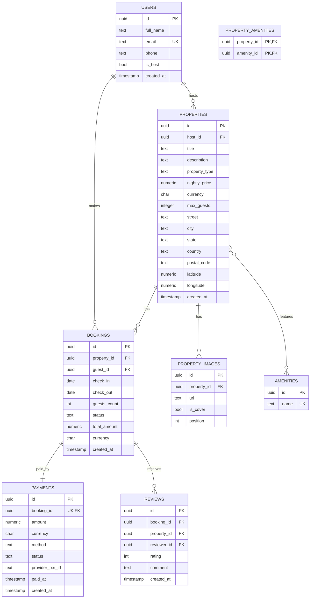

alx-airbnb-database/
├── ERD/
│   └── requirements.md
├── normalization.md
├── database-script-0x01/
│   ├── schema.sql
│   └── README.md
└── database-script-0x02/
    ├── seed.sql
    └── README.md

# ERD/requirements.md

## Scope

Airbnb-like core: **Users**, **Properties**, **Bookings**, **Payments**, plus supporting tables (**Amenities**, **PropertyImages**, **PropertyAmenities**, **Reviews**). One person account model (a `user` can be a host and/or a guest).

## Entities & Key Attributes

### `users`

* `id` (PK, UUID)
* `full_name` (text)
* `email` (text, unique)
* `phone` (text, unique, nullable)
* `is_host` (boolean, default false)
* `created_at` (timestamp)

### `properties`

* `id` (PK, UUID)
* `host_id` (FK → users.id)
* `title` (text)
* `description` (text)
* `property_type` (text, e.g., "apartment", "house")
* `nightly_price` (numeric(10,2))
* `currency` (char(3))
* `max_guests` (integer)
* Address fields (kept denormalized for MVP):

  * `street` (text)
  * `city` (text)
  * `state` (text)
  * `country` (text)
  * `postal_code` (text)
* `latitude` / `longitude` (numeric(9,6))
* `created_at` (timestamp)

### `property_images`

* `id` (PK, UUID)
* `property_id` (FK → properties.id)
* `url` (text)
* `is_cover` (boolean)
* `position` (integer)

### `amenities`

* `id` (PK, UUID)
* `name` (text, unique)

### `property_amenities` (junction)

* `property_id` (FK → properties.id, part of PK)
* `amenity_id` (FK → amenities.id, part of PK)

### `bookings`

* `id` (PK, UUID)
* `property_id` (FK → properties.id)
* `guest_id` (FK → users.id)
* `check_in` / `check_out` (date)
* `guests_count` (integer)
* `status` (text, constrained: 'pending' | 'confirmed' | 'cancelled' | 'completed')
* `total_amount` (numeric(10,2))
* `currency` (char(3))
* `created_at` (timestamp)

### `payments`

* `id` (PK, UUID)
* `booking_id` (FK → bookings.id, unique per booking for simple flow)
* `amount` (numeric(10,2))
* `currency` (char(3))
* `method` (text, e.g., 'card', 'eft')
* `status` (text, constrained: 'pending' | 'paid' | 'failed' | 'refunded')
* `provider_txn_id` (text, unique, nullable)
* `paid_at` (timestamp, nullable)
* `created_at` (timestamp)

### `reviews`

* `id` (PK, UUID)
* `booking_id` (FK → bookings.id)
* `property_id` (FK → properties.id)
* `reviewer_id` (FK → users.id)
* `rating` (integer 1–5)
* `comment` (text)
* `created_at` (timestamp)

## Relationships (cardinalities)

* **User (host)** 1 — *N* **Property** (`properties.host_id → users.id`)
* **User (guest)** 1 — *N* **Booking** (`bookings.guest_id → users.id`)
* **Property** 1 — *N* **Booking** (`bookings.property_id → properties.id`)
* **Property** 1 — *N* **PropertyImage**
* **Property** *N* — *M* **Amenity** via **PropertyAmenities**
* **Booking** 1 — 1 **Payment** (simplified; could be 1—*N* for split payments)
* **Booking** 1 — *N* **Review** (or 0—1 if you prefer exactly one review per stay; here we allow multiple but typically one)

## ER Diagram (Mermaid)



---

# normalization.md

## Goal

Show that the above schema satisfies **1NF → 2NF → 3NF** for the core flows (Users, Properties, Bookings, Payments, Reviews, Amenities).

### 1NF

* All attributes are atomic (e.g., `email`, `nightly_price`, `check_in`).
* Repeating groups split into separate tables: images → `property_images`; amenities → `amenities` + junction `property_amenities`.
* Rows are uniquely identified by primary keys (UUIDs or composite keys in junction table).

### 2NF

* No partial dependency on a subset of a composite key:

  * Only composite key is in `property_amenities(property_id, amenity_id)`. There are **no** non-key attributes in this table, so 2NF holds.
  * Every other table uses a single-column PK; non-key attributes depend on the whole key.

### 3NF

* No transitive dependencies (non-key → non-key → key):

  * `properties.host_id` references `users.id`, but no property attribute depends on `users` attributes; views or joins are used when needed.
  * `bookings.total_amount` depends on the booking itself (dates × nightly\_price × fees). It’s a **derived** value but acceptable for performance; to stay strictly in 3NF you could compute it via views. We keep it with a CHECK constraint + documentation; it does not introduce transitive dependency because it still functionally depends on the booking key.
  * `payments` attributes depend only on `payments.id` (and indirectly on `booking_id` via FK), not on other non-key attributes.
  * `reviews` depend on their own PK; reviewer identity is explicit and independent.

### Notes & Trade‑offs

* Address kept denormalized for speed and simplicity (no `cities`/`countries` tables). This still meets 3NF because address fields functionally depend on the property.
* `status` columns are strings with CHECK constraints for portability; you can swap to enums (e.g., PostgreSQL) if preferred.
* If you need **split payments** or **refunds**, change `payments` to 1—*N* with a unique partial index instead of a uniqueness constraint on `booking_id`.

---

# database-script-0x01/README.md

## Schema Assumptions

* SQL targets **PostgreSQL 14+** (works with minor tweaks on other RDBMS).
* Identifiers are lower\_snake\_case; monetary amounts use `numeric(10,2)`;
* UUIDs are used as primary keys.

## How to run

```bash
psql -v ON_ERROR_STOP=1 -f schema.sql
```

This creates all tables, constraints, and helpful indexes.

---

# database-script-0x01/schema.sql

```sql
-- Schema for Airbnb-like database (PostgreSQL)
-- Idempotency helpers
CREATE EXTENSION IF NOT EXISTS "uuid-ossp";

-- Users
CREATE TABLE IF NOT EXISTS users (
  id          uuid PRIMARY KEY DEFAULT uuid_generate_v4(),
  full_name   text        NOT NULL,
  email       text        NOT NULL UNIQUE,
  phone       text        UNIQUE,
  is_host     boolean     NOT NULL DEFAULT false,
  created_at  timestamp   NOT NULL DEFAULT now()
);

-- Properties
CREATE TABLE IF NOT EXISTS properties (
  id            uuid PRIMARY KEY DEFAULT uuid_generate_v4(),
  host_id       uuid        NOT NULL REFERENCES users(id) ON DELETE RESTRICT,
  title         text        NOT NULL,
  description   text        NOT NULL,
  property_type text        NOT NULL,
  nightly_price numeric(10,2) NOT NULL CHECK (nightly_price >= 0),
  currency      char(3)     NOT NULL,
  max_guests    integer     NOT NULL CHECK (max_guests > 0),
  street        text        NOT NULL,
  city          text        NOT NULL,
  state         text,
  country       text        NOT NULL,
  postal_code   text,
  latitude      numeric(9,6),
  longitude     numeric(9,6),
  created_at    timestamp   NOT NULL DEFAULT now()
);
CREATE INDEX IF NOT EXISTS idx_properties_host ON properties(host_id);
CREATE INDEX IF NOT EXISTS idx_properties_city ON properties(city);

-- Property Images
CREATE TABLE IF NOT EXISTS property_images (
  id           uuid PRIMARY KEY DEFAULT uuid_generate_v4(),
  property_id  uuid      NOT NULL REFERENCES properties(id) ON DELETE CASCADE,
  url          text      NOT NULL,
  is_cover     boolean   NOT NULL DEFAULT false,
  position     integer   NOT NULL DEFAULT 0
);
CREATE INDEX IF NOT EXISTS idx_property_images_property ON property_images(property_id);

-- Amenities
CREATE TABLE IF NOT EXISTS amenities (
  id    uuid PRIMARY KEY DEFAULT uuid_generate_v4(),
  name  text NOT NULL UNIQUE
);

-- Property ↔ Amenities (junction)
CREATE TABLE IF NOT EXISTS property_amenities (
  property_id uuid NOT NULL REFERENCES properties(id) ON DELETE CASCADE,
  amenity_id  uuid NOT NULL REFERENCES amenities(id) ON DELETE RESTRICT,
  PRIMARY KEY (property_id, amenity_id)
);
CREATE INDEX IF NOT EXISTS idx_property_amenities_amenity ON property_amenities(amenity_id);

-- Bookings
CREATE TABLE IF NOT EXISTS bookings (
  id            uuid PRIMARY KEY DEFAULT uuid_generate_v4(),
  property_id   uuid      NOT NULL REFERENCES properties(id) ON DELETE RESTRICT,
  guest_id      uuid      NOT NULL REFERENCES users(id) ON DELETE RESTRICT,
  check_in      date      NOT NULL,
  check_out     date      NOT NULL,
  guests_count  integer   NOT NULL CHECK (guests_count > 0),
  status        text      NOT NULL CHECK (status IN ('pending','confirmed','cancelled','completed')),
  total_amount  numeric(10,2) NOT NULL CHECK (total_amount >= 0),
  currency      char(3)   NOT NULL,
  created_at    timestamp NOT NULL DEFAULT now(),
  CONSTRAINT chk_dates CHECK (check_out > check_in)
);
CREATE INDEX IF NOT EXISTS idx_bookings_property_dates ON bookings(property_id, check_in, check_out);
CREATE INDEX IF NOT EXISTS idx_bookings_guest ON bookings(guest_id);

-- Payments (1:1 with bookings for MVP)
CREATE TABLE IF NOT EXISTS payments (
  id              uuid PRIMARY KEY DEFAULT uuid_generate_v4(),
  booking_id      uuid      NOT NULL UNIQUE REFERENCES bookings(id) ON DELETE CASCADE,
  amount          numeric(10,2) NOT NULL CHECK (amount >= 0),
  currency        char(3)   NOT NULL,
  method          text      NOT NULL,
  status          text      NOT NULL CHECK (status IN ('pending','paid','failed','refunded')),
  provider_txn_id text      UNIQUE,
  paid_at         timestamp,
  created_at      timestamp NOT NULL DEFAULT now()
);
CREATE INDEX IF NOT EXISTS idx_payments_booking ON payments(booking_id);

-- Reviews (per booking, by guest, about property)
CREATE TABLE IF NOT EXISTS reviews (
  id           uuid PRIMARY KEY DEFAULT uuid_generate_v4(),
  booking_id   uuid      NOT NULL REFERENCES bookings(id) ON DELETE CASCADE,
  property_id  uuid      NOT NULL REFERENCES properties(id) ON DELETE CASCADE,
  reviewer_id  uuid      NOT NULL REFERENCES users(id) ON DELETE RESTRICT,
  rating       integer   NOT NULL CHECK (rating BETWEEN 1 AND 5),
  comment      text,
  created_at   timestamp NOT NULL DEFAULT now(),
  CONSTRAINT uq_review_once UNIQUE (booking_id, reviewer_id)
);
CREATE INDEX IF NOT EXISTS idx_reviews_property ON reviews(property_id);
```

---

# database-script-0x02/README.md

## Purpose

Populate the database with realistic sample data to exercise joins, constraints, and typical queries.

## How to run

```bash
psql -v ON_ERROR_STOP=1 -f ../database-script-0x01/schema.sql
psql -v ON_ERROR_STOP=1 -f seed.sql
```

---

# database-script-0x02/seed.sql

```sql
-- Seed data for Airbnb-like database
-- Clear order for FK integrity
TRUNCATE reviews, payments, bookings, property_amenities, amenities, property_images, properties, users RESTART IDENTITY CASCADE;

-- Users (hosts and guests)
INSERT INTO users (id, full_name, email, phone, is_host)
VALUES
  (uuid_generate_v4(), 'Lerato Mokoena', 'lerato@example.com', '+27-82-000-1001', true),
  (uuid_generate_v4(), 'Thabo Dlamini',  'thabo@example.com',  '+27-83-000-2002', false),
  (uuid_generate_v4(), 'Aisha Khan',     'aisha@example.com',  '+27-84-000-3003', true)
RETURNING id, full_name, is_host
\gset

-- Properties (owned by hosts)
INSERT INTO properties (id, host_id, title, description, property_type, nightly_price, currency, max_guests,
                        street, city, state, country, postal_code, latitude, longitude)
VALUES
  (uuid_generate_v4(), :'id', 'Sunny Loft in Maboneng', 'Open-plan loft with skyline views', 'apartment', 950.00, 'ZAR', 2,
   '123 Fox St', 'Johannesburg', 'GP', 'South Africa', '2001', -26.2041, 28.0473),
  (uuid_generate_v4(), :'id_3', 'Cape Breeze Cottage', 'Cozy cottage 5 min from the beach', 'house', 1800.00, 'ZAR', 4,
   '7 Marine Dr', 'Cape Town', 'WC', 'South Africa', '8001', -33.9249, 18.4241)
RETURNING id
\gset

-- Images
INSERT INTO property_images (property_id, url, is_cover, position)
VALUES
  (:'id_1', 'https://pics.example.com/loft1.jpg', true, 1),
  (:'id_1', 'https://pics.example.com/loft2.jpg', false, 2),
  (:'id_2', 'https://pics.example.com/cottage1.jpg', true, 1);

-- Amenities
INSERT INTO amenities (name) VALUES
  ('Wi-Fi'), ('Parking'), ('Pool'), ('Washer'), ('Kitchen')
RETURNING id, name
\gset

-- Property ↔ Amenities
INSERT INTO property_amenities (property_id, amenity_id)
VALUES
  (:'id_1', :'id_6'), -- Wi-Fi
  (:'id_1', :'id_9'), -- Kitchen
  (:'id_2', :'id_6'), -- Wi-Fi
  (:'id_2', :'id_7'), -- Parking
  (:'id_2', :'id_8'); -- Pool

-- Bookings
-- Thabo books the Loft; Aisha (also a host) books the Cottage
INSERT INTO bookings (id, property_id, guest_id, check_in, check_out, guests_count, status, total_amount, currency)
VALUES
  (uuid_generate_v4(), :'id_1', :'id_2', DATE '2025-09-15', DATE '2025-09-18', 2, 'confirmed', 2850.00, 'ZAR'),
  (uuid_generate_v4(), :'id_2', :'id_3', DATE '2025-10-01', DATE '2025-10-05', 3, 'pending',    7200.00, 'ZAR')
RETURNING id
\gset

-- Payments (1:1)
INSERT INTO payments (booking_id, amount, currency, method, status, provider_txn_id, paid_at)
VALUES
  (:'id_10', 2850.00, 'ZAR', 'card', 'paid', 'txn_001', now()),
  (:'id_11', 7200.00, 'ZAR', 'eft',  'pending', NULL, NULL);

-- Reviews (post-stay)
INSERT INTO reviews (booking_id, property_id, reviewer_id, rating, comment)
VALUES
  (:'id_10', :'id_1', :'id_2', 5, 'Amazing loft, spotless and great location!');
